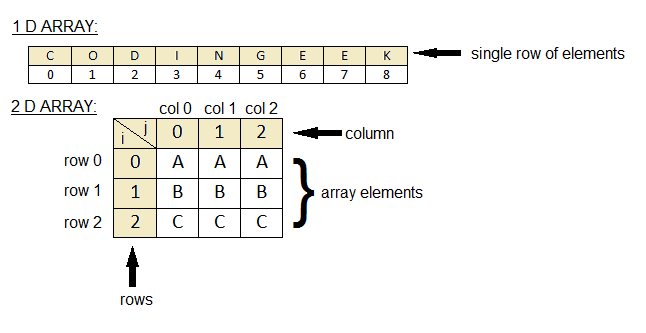

## array
is a data structure that stores a collection of related values that are all the **same type**

<br>
An array is stored in contiguous memory locations and cannot change size after being declared.

<br>

# Accessing Array Elements 
The contents of an array are called elements with each element accessible by an index number. 
<br>
The value of an array element can be changed through an assignment statement, which also requires using the array name and index.


<br>

# Using Loops with Arrays 
Many algorithms require accessing every element of an array to check for data, store information, and other tasks. This can be done in a process called traversing the array, which is often implemented with a for loop because the loop control variable naturally corresponds to array indexes.

<br>

> **A two-dimensional array** is an array of arrays and 
can be thought of as a table. You can also think of a two-dimensional array as a grid for representing a chess board, city blocks, and much more. 

<br>

An array can have more than two dimensions. For example, a[5][3][4] is an array that has 5 elements that each store 3 elements that each store 4 elements.

<br>

imp point:<br>

**To access an element of a two-dimensional array, both the row index and column index are required.**

<br>

```
printf("Element 3 in row 2 is %d\n", a[1][2]);
```



