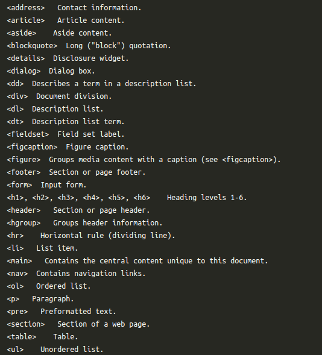
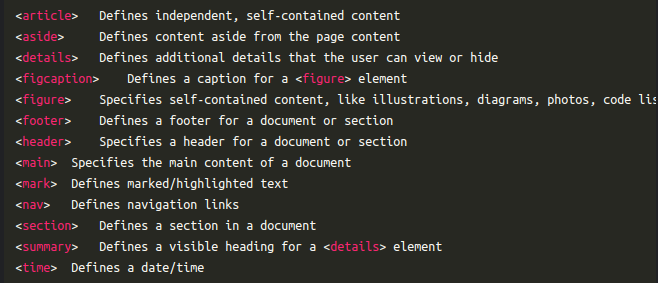

## Attributes
Adding alternative text to images makes your page more accessible

> Attributes usually come in name/value pairs like:
<br>
**name="value"**
<br>
ex:
<br>
```

```

<br>

When only one of the 2 attributes is given, the web browser will calculate the other based on the aspect ratio so the image is not stretched or squeezed.

<br>

The "nav" container tag defines a set of links that allows the user to navigate between pages of a website.

Links to the different pages are added with the anchor tag "a" and nested inside the "nav" container tag.

<br>

A single-page website has all its content on the home page. Any navigation links take the visitor down to different sections (instead of loading new pages).

<br>
The id attribute is used to identify the element you want to target with the navigation link. 

<br>

The hash character (#) is needed to tell the web browser that we are targeting a section of the same page. 

<br>
You might want to add a link at the bottom of a long single-page website to take the user back to the top of the page. You can do this with href="#top" or simply href="#".

<br>
 In HTML, the id attribute is meant to be unique within a single document. Each HTML element should have a unique id attribute to allow for proper identification and manipulation via JavaScript and CSS. If multiple elements within the same document have the same id attribute, it can lead to unexpected and unreliable behavior in your web page.

<br>

Forms are made of input elements like text fields, checkboxes, and submit buttons. These input elements are nested inside the "form" container tag.
<br>

Labels can be added for the different input elements with the label tag.

label => for
<br>
input => id
<br>
input => name
<br>
select => name, id
<br>
label => for(in select)
option => value
An HTML form is a convenient way to send data to a database hosted in a server.

<br>
The name attribute is used to reference the data after submitting the form 


<br>
The value attribute defines the value that is submitted when the input is selected.

<br>

Drop-down menus make your forms more efficient, accessible, and organized.

You can use the "select" container tag to create a drop-down list.
<br>
The "option" container tag is used inside a "select" tag to add choices for the user.

<br>
Submitting a form sends information to a database. The name attribute is needed to submit the form data.


<br>
You can use the "video" container tag to embed video files into a web page.

<br>
You can add video files in different formats. Common video formats are: MP4, OGG and WebM.

```
<video>
<source src="file.mp4"
type="video/mp4">
</video>

```
<br>
You can display play/pause, volume and other video controls with the controls attribute.

<br>
You can embed audio files into web pages with the "audio" container tag.

<br>
Just like video, the "source" tag is used to add source options for audio.

<br>
Just like video, the src attribute adds the audio file URL. The type attribute adds the format.

<br>
You can use autoplay, muted and loop attributes to control the behavior of the multimedia element. Just like controls, these attributes have their default values omitted.
<br>

## Page layout
The body of a web page can be divided into 3 parts.

1. header : The "header" container tag usually contains introductory information. You can add several header elements to a web page.The header often contains navigation links, a menu and/or a search bar. Brand elements like logos are usually found in the header too.


2. main content : The "main" container tag is used to include the main content of a web page. There must not be more than one "main" element in a document.


3. footer : The "footer" container tag often contains contact and legal information and links.You can have several "footer" elements in one document.

**header, main and footer elements are nested inside the body container tag**

<br>

#### article:
1. represents an independent, self-contained piece of content.
2. content that would make sense on its own.
3. clearly indicates the role for its content.
4. used for content like news stories, and blog posts.
<br>
Layout tags like header>, main>, footer> and article> are semantic tags because they give information about what they contain.
<br>

#### section: 
1. helps to break down the content into parts.
2. semantic tag
3. It usually includes a heading.
<br>


#### aside:
1. used for secondary, additional or somehow related content.


**Semantic tags don’t give any visual effect to the content. You can nest layout elements to create organized and accessible pages.**


<br>
The style attribute can make your life a whole lot easier when it comes to formatting. You can customize multiple properties at the same time. Just separate each property:value pair with a semicolon (;).

<br>
You can control the font size with the font-size property.

<br>
```
<h1 style="text-align:left; font-size:small">Some text</h1>
```

Some style properties require multiple values. The border property is an example of that
<br>
The border property is a short and simple way to refer to 3 different sub-properties. That’s why it can take 3 values.
<br>
```
<p style="border:1px solid red">
Some text</p>
```
<br>
- border-width
- border-style
- border-color

<br>

Every HTML element is either inline(Don't start on a new line) or block(Start on a new line).

inline => p, format tags, button


<br>
Inline elements can be nested inside block-level elements.

<br>

<h3>The "div" element is a container for HTML elements that keeps your pages organized

</h3>

You can use "div" to apply the same style to a group of elements
<br>
The style in a "div" container will apply to all its nested elements unless you give them their own.
<br>

<div strle = "text-align : center"> 



</div>


## semantic tags
<br>




<br>
Tables help you display data in a way that’s easy to scan, compare, and analyze.
<br>
You can add a table to your web page with the "table" container tag


<br>
You can add rows to a table with the "tr" (table row) container tag. Rows are nested inside the "table" tag.

<br>
You can add cells with the "td" (table data) container tag. They are nested inside rows.
<br>
Tables usually include headers. A header is a special row at the top of the table used to label each column. 

 

You can create header cells with "th"

<br>

You can make cells that take up multiple rows and/or columns, using the attributes colspan and rowspan. This is called merging cells.

 

colspan is for the number of columns a cell should span.