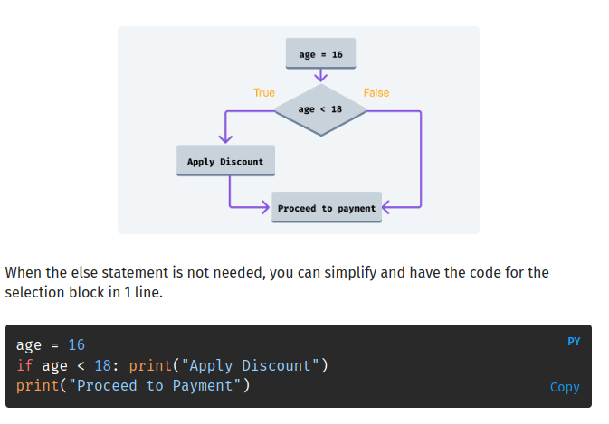

Coders use snake case to give descriptive names to variables with multiple words. The underscore makes the variable name easier to read.

<br>

A variable name can contain numbers but cannot start with a number.

## input
The input() instruction is the easiest way to allow a user to insert a value into your program.

## output
An output is a way for the computer to communicate with the outside world. A message displayed on the screen and the sound from a speaker are examples of outputs.

<br>
The input() instruction always turns the user input into a string, no matter what the user enters.


<br>

explicit => int(),str(),float()
<br>
implicit => 5/2"float", input()"str"

<br>
Computers use binary code to represent information. By turning switches ON and OFF, we change the information stored in a computer.
<br><br>


<br>
The Boolean is a data type that only has two possible values: True or False.
<br>

This data type is named after **George Boole**, who created the theory that is the basis for modern computers.

<br>
Comparison operations and Boolean values allow machines to make decisions.

> and


<br>

> or


> control flow


1. sequence
<br>


<br>

2. iteration
<br>

 
<br>


=> loop
<br>

        - while => while loops repeat code whilst a condition holds

        - for

<br>
3. selection

<br>


Selection is like a fork in the road. It allows your programs to decide which path to take. =>if-else statements


**Conditional statements allow you to program machines that make decisions.**


<br>

# algorithm
is a set of step-by-step instructions to complete a task, placed in a certain order.
represented =>
1. flowcharts
    - sequence
    - iteration
2. pseudocode 
    > simplified language that is a bit closer to a programming language.
3. natural language


<br>
A loop can repeat multiple statements. They all need to be indented.

```
print (5 == 5)
print (5 == 7)
print (5 != 7)
print (5 != 5)
print (5 <= 5)
print (5 >= 5)
```

You know how many iterations: for loop
You don’t know how many iterations: while loop

<br>



You can use the elif statement (short for "else if") to check for more conditions if the first condition is not met.

# list


<br>

Lists allow you to store a collection of multiple values in a single variable.
<br>
Lists can contain values of different data types.
<br>
You can place list items on separate lines to make the code easier to read.
<br>
Lists are ordered collections of items. You can access an item in a list using its position or index number.

<br>
Lists are mutable. This means you can change their values even after they've been created.

<br>
Indexing also works with strings. You can use indexing to access individual characters in a string

list => mutable
string => immutable
tuple => immutable

<br>
Both lists and strings are Python sequences. Which means that their content is ordered.
<br>

### slice
list[0:2]
The starting index is inclusive. The stopping index is exclusive.
<br>
indexing from the end => negative indexing

# function


<br><br>


<br><br>

Multiple arguments in a function are separated with a comma ,
<br>
 built-in function:
  Python has many built-in functions which you can re-use in your code by calling them.
  arguments:
  - print() => any data type , math, logical and comparison operations.
  - range() => just integer
  

<br>

## Inputs and Outputs
An input is any information that goes into a computer.
<br>
The press of a key and the click of a button are examples of inputs.
<br>
the video captured from a camera that is connected to a computer is another example of input
<br>
An output is a way for the computer to communicate with the outside world. A message displayed on the screen and the sound from a speaker and a document coming out of a printer
 are examples of outputs.

<br>


## string function

> The find() function checks if a character (or a pattern of characters) is present in a string. The function returns the index (position) of the given value. If the given value is present multiple times, the function will return the first occurrence (the lowest index).

**find() will return -1 if the value can't be found in the string.**

## list function
    - len() => return length list
    - append() => add end of the list
    - insert() => add element to a list at a specific position
    - pop() =>  removes an element from a list.


# function 
1. Reusable block of code
2. performs a task
3. only runs when called
## custom function
define once => call it as many times as you need


<br>


# Dictionaries
 map arbitrary keys to values
=>  key:value
=> This means that you can use strings, integers, booleans, and any other immutable type as dictionary keys.

# Tuple


<br>

**Tuples can be created without the parentheses by just separating the values with commas.**

## Tuple unpacking 
allows you to assign each item in a collection to a variable.
<br>

```
numbers = (1, 2, 3)
a, b, c = numbers
print(a)
print(b)
print(c)

```
<br>


When to use a dictionary:
- When you need a logical association between a key:value pair.

- When you need fast lookup for your data, based on a custom key.

- When your data is being constantly modified. Remember, dictionaries are mutable.

When to use the other types:
- Use lists if you have a collection of data that does not need random access. Try to choose lists when you need a simple, iterable collection that is modified frequently.

- Use a set if you need uniqueness for the elements. 

- Use tuples when your data cannot/should not change.


# Functional programming

A key part of functional programming is higher-order functions. Higher-order functions take other functions as arguments, or return them as results.

1. pure function
Pure functions have no side effects, and return a value that depends only on their arguments.

- Always produces the same output for the same input (deterministic).

- Does not have any side effects, meaning it does not modify external state or variables.


<br>

2. Map
The built-in functions map and filter are very useful higher-order functions that operate on lists (or similar objects called iterables). 

3. filter 
The function filter filters an iterable by leaving only the items that match a condition (also called a predicate).
 

4. Generators
Generators are a type of iterable, like lists or tuples. 
<br>
Unlike lists, they don't allow indexing with arbitrary indices, but they can still be iterated through with for loops. 
<br>
They can be created using functions and the yield statement.


<br>

> Imagine you have a big jar of cookies, but you don't want to take out all the cookies at once because you might not have enough space to hold them all. Instead, you want to take out one cookie at a time and eat it. This way, you only need a small plate to hold the cookies.

In Python, a generator is like that cookie jar. It's a way to create a sequence of values, but it doesn't generate all of them at once. It generates them one at a time, only when you need them, just like taking out one cookie at a time.

Now, the yield keyword is like the magic hand that takes out cookies from the jar. When you use yield in a function, it's like temporarily pausing that function and giving you a cookie (or a value) from the sequence. But here's the cool part: the function remembers where it left off, like a bookmark in a book, so when you ask for the next value, it continues from there.

5. Decorators 
Decorators provide a way to modify functions using other functions. 
<br>
Python provides support to wrap a function in a decorator by pre-pending the function definition with a decorator name and the @ symbol.

6. Recursion

> The fundamental part of recursion is self-reference -- functions calling themselves. It is used to solve problems that can be broken up into easier sub-problems of the same type.

like factorial


### *args

**varying numbers of arguments**

<br>
Using *args as a function parameter enables you to pass an arbitrary number of arguments to that function. The arguments are then accessible as the tuple args in the body of the function.
<br>
The name args is just a convention; you can choose to use another.

