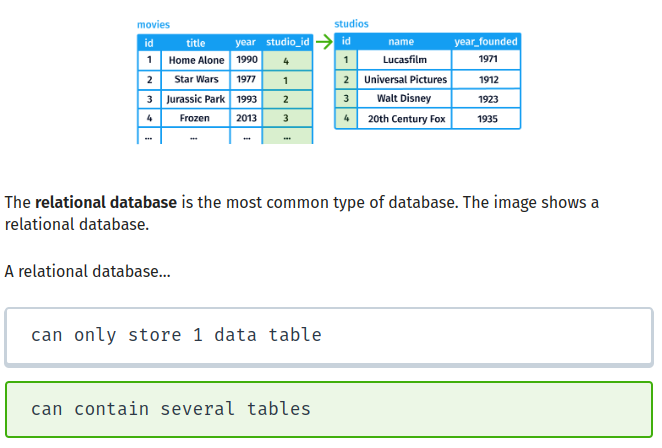

Data lives in databases. Just about every company and organization relies on some form of database to store and organize information.

 

SQL code is used to send requests to a database. These requests are known as queries.

 

The SELECT command is used to extract field data from a table․

 

## structured data
Data that can be stored in tables

 

Unstructured data is information that is difficult to store in tables.

