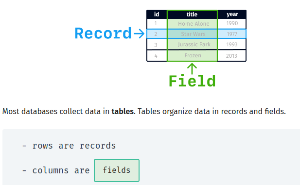

Data lives in databases. Just about every company and organization relies on some form of database to store and organize information.

 

SQL code is used to send requests to a database. These requests are known as queries.

 

The SELECT command is used to extract field data from a table․

 

## structured data
Data that can be stored in tables

 

Unstructured data is information that is difficult to store in tables.

The different tables in a relational database connect to each other using fields (columns) with values in common. These fields are called keys.

 

database schema:
 
is a visual representation of how a database is organized, showing its tables, fields and keys. Arrows are used to show how the different tables are related.

 
The * symbol allows you to select all the fields in a table

 

comments => -- => one line
            /* */ => multiple line